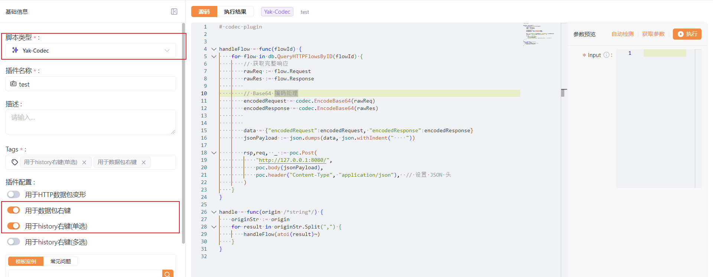

# Yakit 联动 Python
如果想要实现 Yakit 联动 Python, 只能选择将流量包发送到 Python 程序进行解析, 我的想法是将请求信息和响应信息直接 Base64 编码提供给 Python 程序。

在操作的时候为了方便建议将其加入到鼠标右键中可以快速进行操作。



```go
# codec plugin

handleFlow = func(flowId) {
    for flow in db.QueryHTTPFlowsByID(flowId) {
        // 获取完整响应
        rawReq := flow.Request
        rawRes := flow.Response
        
        // Base64 编码处理
        encodedRequest = codec.EncodeBase64(rawReq)
        encodedResponse = codec.EncodeBase64(rawRes)
        
        
        data = {"encodedRequest":encodedRequest, "encodedResponse":encodedResponse}
        jsonPayload := json.dumps(data, json.withIndent("    "))

        rsp,req,  _ := poc.Post(
            "http://127.0.0.1:8080/",
            poc.body(jsonPayload),
            poc.header("Content-Type", "application/json"),  // 设置 JSON 头
        )
    }
}

handle = func(origin /*string*/) {
    originStr := origin
    for result in originStr.Split(",") {
        handleFlow(atoi(result)~)
    }
}
```